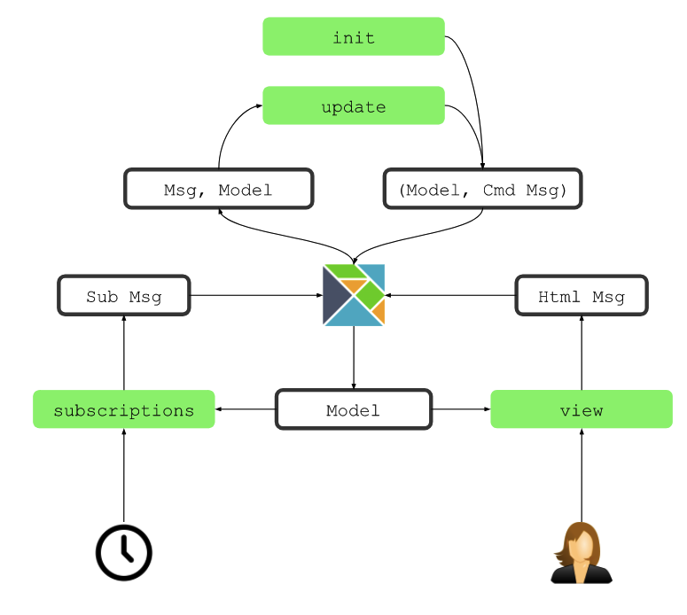

## 4th Elixir Meetup - Elixir, meet Elm!

<br>
---

## Ali-Pasha Foroughi


<br>
[3]:	http://hallofrankfurt.de/
---

# Elm Einführung
### Der Compiler ist Dein Freund

---

### <span style="color:white"> <span style="color:gray"> Elm
## <span style="color:#42AFFA"> Elm Basics
### <span style="color:gray"> Elm Architecture

---


<br>
## Jan Fornoff

### Using Elm in Practice
[30]:	https://github.com/jfornoff
---

### <span style="color:white"> <span style="color:gray"> Elm
## <span style="color:#42AFFA"> Elm Basics

---

# Elm

<br>

[elm-lang.org][4]
[4]:	http://elm-lang.org/

Twitter: [@elmlang][5]
[5]:	https://twitter.com/elmlang

Github: [@elm-lang][6]
[6]:	https://github.com/elm-lang/
---

# Evan Czaplicki

<br>

Twitter: [@czaplic][8]

Github: [@evancz][9]

Works at: [@noredink][10]

[8]:	https://twitter.com/czaplic
[9]:	https://gihub.com/evancz
[10]:	https://twitter.com/noredink

---

# Elm (0.18)

* Functional Language 
* Compiles to Javascript
* Slogan: No Runtime Errors

---

## <span style="color:#42AFFA"> Functional Language
*  Pure Functions
*  Types
*  Managing Effects 

---

# <span style="color:#42AFFA"> [Install][11]

npm install -g elm 

elm-package install


[11]:	http://elm-lang.org/
---

# <span style="color:#42AFFA"> Create Elm apps

npm install create-elm-app -g

create-elm-app my-app

cd my-app/

elm-app start

---

## <span style="color:#42AFFA"> Elm Architecture

---

![][image-3]

[image-3]:   https://zenzoa.com/wp-content/uploads/2016/09/Diagram-Elm-500x435.png

zenzoa.com/programming-for-non-programmers
---

# Model

* immutable Data 
* represents the entire application State
* single Source of Truth

```elm
type alias Model =  { ... } -- some data structure
```

---

# Update
 
* takes the current model 
* takes a message describing desired changes
* returns a revised model

```elm
update : Msg -> Model -> Model
```

---

# View

* accepts the revised model 
* returns a representation of the desired DOM structure

```elm
view : Model -> Html Msg
```

---

![][image-1]

```elm
--Model
type alias Model =  { ... } -- some data structure

--View
view : Model -> Html Msg

-- Update
view : Msg -> Model -> Model
```
[image-1]:	https://guide.elm-lang.org/architecture/effects/beginnerProgram.svg

---

# Demo


---

# Subscriptions

* components sit around and wait for messages 
* library code handles resource management 

```elm

-- subscriptions
subscriptions : Model -> Sub Msg

```

---



## [@plaxdan/elm-lifecycle] [42]
[42]:	https://github.com/plaxdan/elm-lifecycle/blob/master/README.md

---

![][image-2]

```elm
--Model
type alias Model =  { ... } -- some data structure

--View
view : Model -> Html Msg

-- subscriptions
subscriptions : Model -> Sub Msg

-- Update
update : Msg -> Model -> ( Model, Cmd Msg )
```
[image-2]:	https://guide.elm-lang.org/architecture/effects/program.svg

---

# Subscriptions

## Demo

---

# Links

* [elm-lang.org][15]
* [Elm on Github - @elm-lang][16] 
* [The Elm Architecture + Effects][17]
* [Richard Feldman - Language-Level Reactivity][18]

[15]:	http://elm-lang.org/
[16]:	https://github.com/elm-lang/
[17]:	https://guide.elm-lang.org/architecture/effects/
[18]:	https://www.infoq.com/articles/language-reactivity-with-elm
[19]:	https://github.com/webpro/reveal-md/

---

## Presentations as Markdown

[reveal-md][19]

## See also

[reveal-js][20]

[19]:	https://github.com/webpro/reveal-md/
[20]:	http://lab.hakim.se/reveal-js/#/

---

## Ali-Pasha Foroughi

Twitter: [@alipasha][21]

Github: [@1use][22] 

[21]:	https://twitter.com/alipasha
[22]:	https://gihub.com/1use
[23]:	http://hallofrankfurt.de

---

## Jan Fornoff

### Using Elm in Practice

Github: [@jfornoff][32] 
[32]:	https://github.com/jfornoff
[blog.janfornoff.com][33]
[33]:  http://blog.janfornoff.com/

---

# Thank You!

## [Elixir Meetup][24]

## [ioki - Inspiring Smart Mobility][25]


[1]:	https://www.meetup.com/Elixir-Meetup-Rhein-Main/events/247183995/
[2]:	https://www.meetup.com/Elixir-Meetup-Rhein-Main/events/247183995/
[3]:	http://hallofrankfurt.de/
[4]:	http://elm-lang.org/
[5]:	https://twitter.com/elmlang
[6]:	https://github.com/elm-lang/
[7]:	https://www.seas.harvard.edu/sites/default/files/files/archived/Czaplicki.pdf
[8]:	https://twitter.com/czaplic
[9]:	https://gihub.com/evancz
[10]:	https://twitter.com/noredink
[11]:	http://elm-lang.org/
[12]:	https://guide.elm-lang.org/architecture/effects/
[13]:	http://elm-lang.org/examples/buttons
[14]:	https://www.elm-tutorial.org/en/03-subs-cmds/01-subs.html
[15]:	http://elm-lang.org/
[16]:	https://github.com/elm-lang/
[17]:	https://guide.elm-lang.org/architecture/effects/
[18]:	https://www.infoq.com/articles/language-reactivity-with-elm
[19]:	https://github.com/webpro/reveal-md/
[20]:	http://lab.hakim.se/reveal-js/#/
[21]:	https://twitter.com/alipasha
[22]:	https://gihub.com/1use
[23]:	http://hallofrankfurt.de
[24]:	https://www.meetup.com/Elixir-Meetup-Rhein-Main/events/247183995/
[25]:	http://www.ioki.com/

[image-1]:	https://guide.elm-lang.org/architecture/effects/beginnerProgram.svg
[image-2]:	https://guide.elm-lang.org/architecture/effects/program.svg